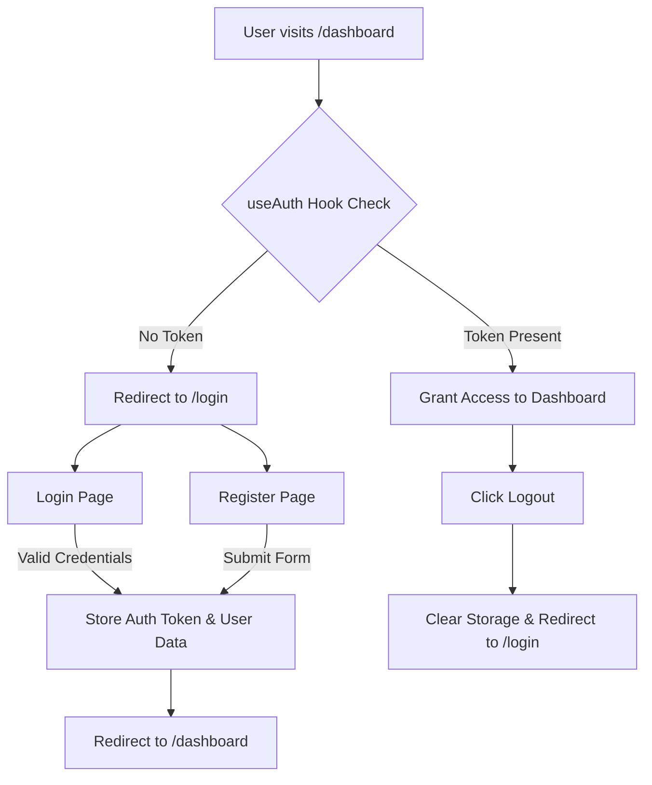

# 📊 HisabDo - Financial Management & Digital Khata App

HisabDo is a modern, local-first web application designed for small business owners, freelancers, and shopkeepers to track cash flow, log digital khata transactions (Udhar/Got), and manage daily expenses seamlessly.

---

## 🛠️ Tech Stack & Architecture

- **Framework:** Next.js 14 (App Router)
- **Language:** TypeScript
- **Styling:** Tailwind CSS (Dark Emerald Theme System)
- **Database & Auth:** Supabase (PostgreSQL & Native Auth Services)
- **State & Context:** React Context API (`AuthContext`)
- **Icons:** Lucide React

---

## 🔐 Authentication & Security Flow



## 🚀 Getting Started

### 1. Clone the Repository
```bash
git clone [https://github.com/usmankhalid172/hisabdo-mern-webapp.git](https://github.com/usmankhalid172/hisabdo-mern-webapp.git)
cd hisabdo-mern-webapp
```
### 2. Install Dependencies
```bash
npm install
```
### 3. Configure Environment Variables
Create a .env.local file in the root directory and configure your Supabase credentials:
```bash
NEXT_PUBLIC_SUPABASE_URL=your_supabase_project_url
NEXT_PUBLIC_SUPABASE_ANON_KEY=your_supabase_anon_key
```
### 4. Run Development Server
```bash
npm run dev
```
Open http://localhost:3000 in your browser to view the application.

## 📁 Key Folder Structure
```text
src/
├── app/
│   ├── (auth)/             # Authentication routes (/login, /register)
│   ├── (dashboard)/        # App routes (/dashboard, /transactions)
│   ├── api/                # API route handlers
│   ├── layout.tsx          # Root layout wrapped with AuthProvider
│   └── page.tsx            # Landing homepage
├── components/             # Reusable UI components
├── context/                # AuthContext & global providers
├── lib/                    # Supabase client & utilities
└── types/                  # TypeScript interface definitions
```

